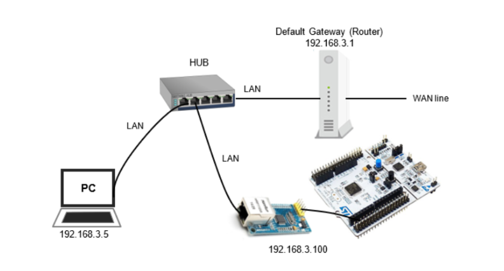
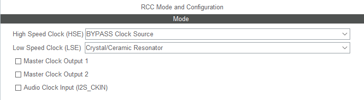
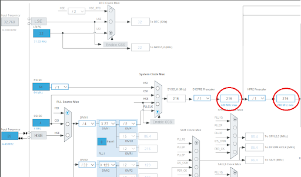
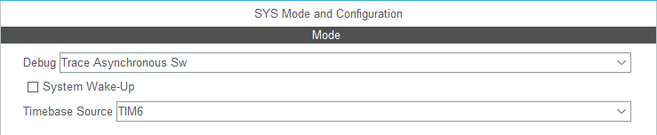
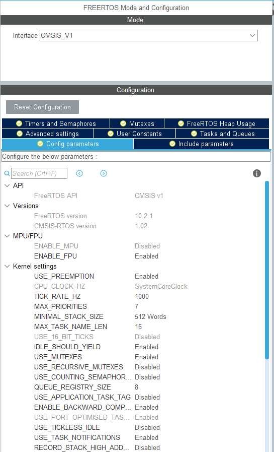
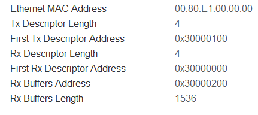
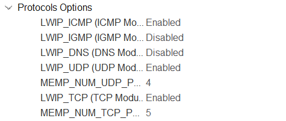
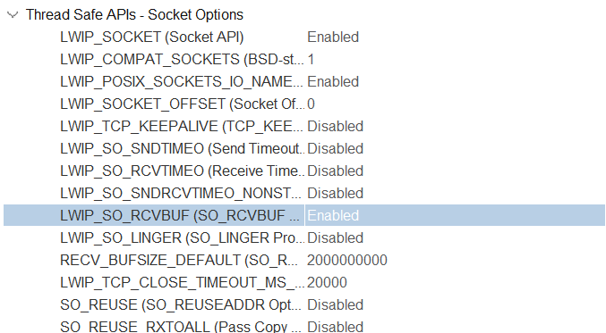
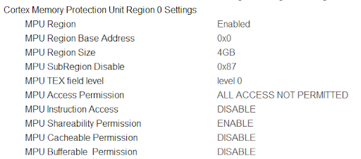
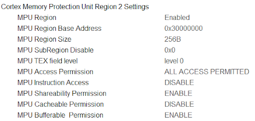

# STM32H7 Ethernet & MQTT Setup Guide
> Quick-start instructions for configuring Ethernet (RMII) and MQTT protocol on the **STM32H755ZI-Q** (M7 core), bare-metal (no RTOS), using **STM32CubeIDE 1.19.0**.

--- 
## Table of Contents
1. [Overview](#overview)
2. [Board Setup](#board-setup)
3. [Hardware Configuration](#hardware-configuration)
4. [Software Configuration](#software-configuration)
5. [References](#references)

---
## Overview

This guide covers setting up Ethernet on the STM32H755ZI-Q using:

- **Protocol:** RMII without memory configuration (100 Mbits/s)
- **Middleware:** LwIP stack
- **Communication:** MQTT package/topic/communication
- **IDE:** STM32CubeIDE 1.19.0

> ⚠️ This configuration uses the **M7 core**.

---

### Board Setup 
1. Connect the board to power supply or USB cable for flashing 
2. Connect the board to a **router/switch** via RJ45 cable 


<p align="center">
Example of board setup for MQTT protocol 
<p>

## Hardware Configuration 
(using .ioc file)
### 1. Create a Project 
1. Open STM32CubeIDE → create a new project 
2. Select board: **STM32H755ZI_Q** (or the board currently using)
3. When prompted *"Initialize all peripherals in default mode?"* → select **No**
4. In the `.ioc` file, clear all Pinouts for a clean PIN configuration

---

### 2. Basic Configuration 
**Enable the clock:**
```
System Core → RCC → HSE → Crystal / Ceramic Resonator
```


**Clock configuration:**

```
Enable CSS → Configure 216 MHz for core
```


<p align="center">
Example of clock configuration to avoid Aliasing  
<p>

**SYS configuration:** 
Since we using FreeRTOS, the `Timebase Source` is set to `TIM6`


---

### 3. Enable FreeRTOS
**Navigate to:**
```
Middleware → FreeRTOS_M7 → Interface → CMSIS_V1
```
Change `ENABLE_FPU` and `MINIMAL_STACK_SIZE`.



---

### 4. Enable ETH Protocol

**Navigate to:**

```
Connectivity → ETH → Select M7 → Enable → Mode: RMII
```

**GPIO Settings:**

Verify the GPIO pins are configured correctly as stated in the Datasheet (default settings are usually correct). If not, adjust manually. Ensure **Maximum Output Speed is set to VERY HIGH** where required.

| Pin  | Function              | Max Output Speed |
|------|-----------------------|-----------------|
| PA1  | RMII Ref Clock        | VERY HIGH        |
| PA2  | RMII MDIO             | VERY HIGH        |
| PC1  | RMII MDC              | LOW              |
| PA7  | RMII Rx Data Valid    | VERY HIGH        |
| PC4  | RMII RXD0             | VERY HIGH        |
| PC5  | RMII RXD1             | VERY HIGH        |
| PG11 | RMII TX Enable        | VERY HIGH        |
| PG13 | RMII TXD0             | VERY HIGH        |
| PB13 | RMII TXD1             | VERY HIGH        |

<p align="center">
Example table of GPIO Settings for Ethernet connection   
<p>

**Parameter Settings:** 



<p align="center">
The ETH Parameter Settings for proper connection  
<p>

Leave all remaining ETH parameters as default.
---
### 5. Enable LwIP
**Navigate to:**
```
Middleware → LWIP → Enable LWIP on Cortex M7
```
**General Settings:**
- Disable DHCP
- Configure a static IP address manually (for ping test):
  - IP Address: `192.168.1.120` *(example)*
  - Netmask: `255.255.255.0`
  - Gateway: `192.168.1.1` or `0.0.0.0` (need to check)



<p align="center">
Protocol Options for LWIP  
<p>

**Platform Settings:**
- Select **LAN8742**

**Key Options:**

- `MEM_SIZE` → `1600` Bytes
- `LWIP_RAM_HEAP_POINTER`: `0x30002000`
- `ETH_RX_BUFFER_CNT`: `12`

- With RTOS enabled, then enable `LWIP_NETIF_LINK_CALLBACK` to check LINK status

- Enable `LWIP_SO_RCVBUF` to check the receive buffer in MQTT library 


**Checksum:**

Makesure `CHECKSUM_BY_HARDWARE` is enabled.

---
### 6. Enable the Cache

```
System Core → Cortex_M7 → Parameter Settings
```

- Enable **CPU ICache**
- Enable **CPU DCache**

---

### 7. Checkpoint 1 ✅

Build the code and verify the following are correct:

- Tx / Rx Descriptor addresses
- Tx / Rx buffer sizes

---

### MPU Configuration

```
System Core → Cortex_M7 → Parameter Settings
```

Configure three MPU regions (need to check the **datasheet** for correct memory address):


| Region | Purpose                                     | Base Address |
|--------|---------------------------------------------|--------------|
| 0      | Memory protection for entire board          | D2 SRAM2     |
| 1      | Memory protection for LwIP Heap             | `0x30002000` |
| 2      | Memory protection for Tx & Rx Descriptors   | `0x30000000` |

Enable MPU and set the following Regions as below:

- MPU Settings for Region 0 (memory protection for entire board)



- MPU Settings for Region 1 (memory protection for LWIP_Heap)


- MPU Settings for Region 2 (memory protection for Tx & Rx Descriptors)



---

## References 
- https://github.com/eziya/STM32F4_HAL_ETH_MQTT_CLIENT
- https://community.st.com/t5/stm32-mcus/how-to-create-a-project-for-stm32h7-with-ethernet-and-lwip-stack/ta-p/49308


