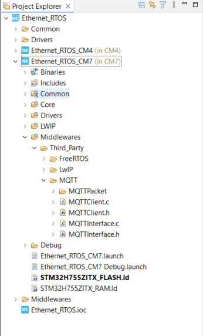
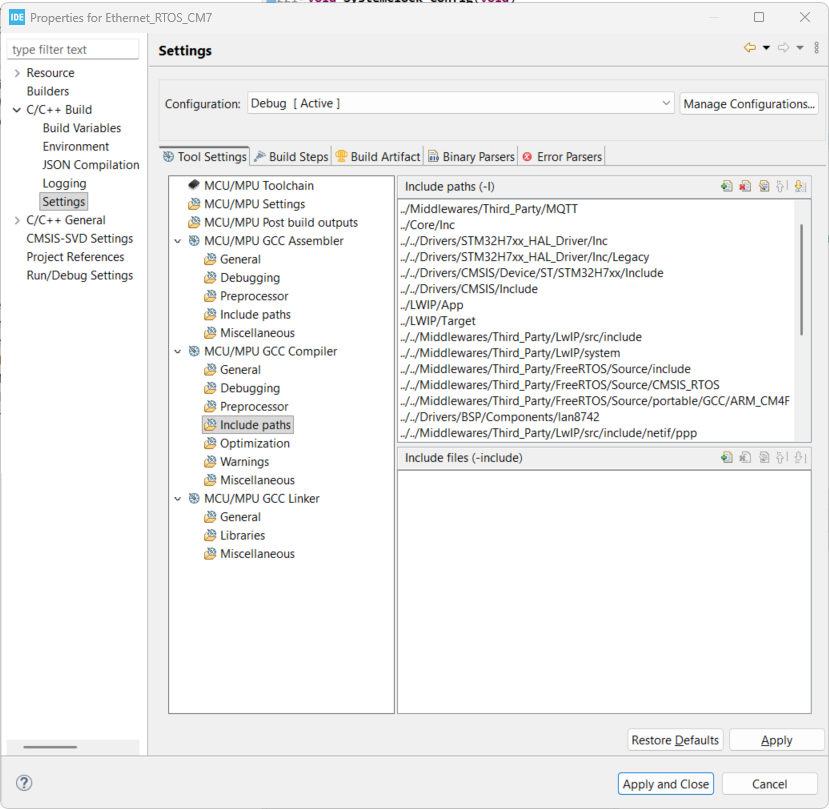

# STM32H7 Ethernet & MQTT Setup Guide
> Quick-start instructions for configuring Ethernet (RMII) and MQTT protocol on the **STM32H755ZI-Q** (M7 core), bare-metal (no RTOS), using **STM32CubeIDE 1.19.0**.

--- 
## Table of Contents
1. [Overview](#overview)
2. [Board Setup](#board-setup)
3. [Hardware Configuration](#hardware-configuration)
4. [Software Configuration](#software-configuration)
5. [Checkpoint 1](#checkpoint-1)
5. [MQTT Dependencies](#mqtt)
6. [References](#references)

---
## Overview

This guide covers setting up Ethernet on the STM32H755ZI-Q using:

- **Protocol:** RMII without memory configuration (100 Mbits/s)
- **Middleware:** LwIP stack
- **Communication:** MQTT package/topic/communication
- **IDE:** STM32CubeIDE 1.19.0

> ⚠️ This configuration uses the **M7 core**.

---

### Board Setup 
1. Connect the board to power supply or USB cable for flashing 
2. Connect the board to a **router/switch** via RJ45 cable 


<p align="center">
Example of board setup for MQTT protocol 
<p>

## Hardware Configuration 
(using .ioc file)
### 1. Create a Project 
1. Open STM32CubeIDE → create a new project 
2. Select board: **STM32H755ZI_Q** (or the board currently using)
3. When prompted *"Initialize all peripherals in default mode?"* → select **No**
4. In the `.ioc` file, clear all Pinouts for a clean PIN configuration

---

### 2. Basic Configuration 
**Enable the clock:**
```
System Core → RCC → HSE → Crystal / Ceramic Resonator
```


**Clock configuration:**

```
Enable CSS → Configure 216 MHz for core
```


<p align="center">
Example of clock configuration to avoid Aliasing  
<p>

**SYS configuration:** 
Since we using FreeRTOS, the `Timebase Source` is set to `TIM6`


---

### 3. Enable FreeRTOS
**Navigate to:**
```
Middleware → FreeRTOS_M7 → Interface → CMSIS_V1
```
Change `ENABLE_FPU` and `MINIMAL_STACK_SIZE`.


---

### 4. Enable ETH Protocol

**Navigate to:**

```
Connectivity → ETH → Select M7 → Enable → Mode: RMII
```

**GPIO Settings:**

Verify the GPIO pins are configured correctly as stated in the Datasheet (default settings are usually correct). If not, adjust manually. Ensure **Maximum Output Speed is set to VERY HIGH** where required.

| Pin  | Function              | Max Output Speed |
|------|-----------------------|-----------------|
| PA1  | RMII Ref Clock        | VERY HIGH        |
| PA2  | RMII MDIO             | VERY HIGH        |
| PC1  | RMII MDC              | LOW              |
| PA7  | RMII Rx Data Valid    | VERY HIGH        |
| PC4  | RMII RXD0             | VERY HIGH        |
| PC5  | RMII RXD1             | VERY HIGH        |
| PG11 | RMII TX Enable        | VERY HIGH        |
| PG13 | RMII TXD0             | VERY HIGH        |
| PB13 | RMII TXD1             | VERY HIGH        |

<p align="center">
Example table of GPIO Settings for Ethernet connection   
<p>

**Parameter Settings:** 


<p align="center">
The ETH Parameter Settings for proper connection  
<p>

Leave all remaining ETH parameters as default.

---
### 5. Enable LwIP
**Navigate to:**
```
Middleware → LWIP → Enable LWIP on Cortex M7
```
**General Settings:**
- Disable DHCP
- Configure a static IP address manually (for ping test):
  - IP Address: `192.168.1.120` *(example)*
  - Netmask: `255.255.255.0`
  - Gateway: `192.168.1.1` or `0.0.0.0` (need to check)


<p align="center">
Protocol Options for LWIP  
<p>

**Platform Settings:**
- Select **LAN8742**

**Key Options:**

- `MEM_SIZE` → `1600` Bytes
- `LWIP_RAM_HEAP_POINTER`: `0x30002000`
- `ETH_RX_BUFFER_CNT`: `12`

- With RTOS enabled, then enable `LWIP_NETIF_LINK_CALLBACK` to check LINK status

- Enable `LWIP_SO_RCVBUF` to check the receive buffer in MQTT library 


**Checksum:**

Makesure `CHECKSUM_BY_HARDWARE` is enabled.

---
### 6. Enable the Cache

```
System Core → Cortex_M7 → Parameter Settings
```

- Enable **CPU ICache**
- Enable **CPU DCache**

---

### 7. Checkpoint 1 ✅

Build the code and verify the following are correct:

- Tx / Rx Descriptor addresses
- Tx / Rx buffer sizes

---

### MPU Configuration

```
System Core → Cortex_M7 → Parameter Settings
```

Configure three MPU regions (need to check the **datasheet** for correct memory address):


| Region | Purpose                                     | Base Address |
|--------|---------------------------------------------|--------------|
| 0      | Memory protection for entire board          | D2 SRAM2     |
| 1      | Memory protection for LwIP Heap             | `0x30002000` |
| 2      | Memory protection for Tx & Rx Descriptors   | `0x30000000` |

Enable MPU and set the following Regions as below:

- MPU Settings for Region 0 (memory protection for entire board)


- MPU Settings for Region 1 (memory protection for LWIP_Heap)


- MPU Settings for Region 2 (memory protection for Tx & Rx Descriptors)


---

## Software Configuration 

In this setup, we only used **CM7 Core**

### `STM32H755ZITX_FLASH.ld` ⚠️ MOST IMPORTANT

Add the following linker script section to map LwIP buffers to D2 SRAM:

```ld
/* Modification start */
.lwip_sec (NOLOAD) :
{
  . = ABSOLUTE(0x30000000);
  *(.RxDecripSection)
 
  . = ABSOLUTE(0x30000100);
  *(.TxDecripSection)
 
  . = ABSOLUTE(0x30000200);
  *(.Rx_PoolSection)
 
} >RAM_D2
```

---

### `ethernetif.c`

Check and add these lines of code if not show in `ethernetif.c`:

```
Project Explorer → CM7 → LWIP → Target → ethernetif.c
```

```c
/* USER CODE BEGIN 2 */
#if defined ( __ICCARM__ ) /*!< IAR Compiler */
#pragma location = 0x30000200
extern u8_t memp_memory_RX_POOL_base[];
 
#elif defined ( __CC_ARM ) /* MDK ARM Compiler */
__attribute__((at(0x30000200))) extern u8_t memp_memory_RX_POOL_base[];
 
#elif defined ( __GNUC__ ) /* GNU Compiler */
__attribute__((section(".Rx_PoolSection"))) extern u8_t memp_memory_RX_POOL_base[];

#endif
/* USER CODE END 2 */
```

---

### `main.c`
 
Call `MX_LWIP_Process()` in the main loop, along with an LED heartbeat to confirm the system is not hanging:
 
```c
int main(void)
{
  // ...
 
  while (1)
  {
    MX_LWIP_Process();
 
    /* Flashing LED to confirm system is running */
    if (count++ & 0x040000)
    {
      BSP_LED_On(LED_GREEN);
    }
    else
    {
      BSP_LED_Off(LED_GREEN);
    }
 
    /* USER CODE END WHILE */
    /* USER CODE BEGIN 3 */
  }
 
  // ...
}
```

---

## Checkpoint 1 
- Build & Flash the board to check for errors 
- Connect the board to a router/switch via RJ45 cable (like the setup above)
- From your laptop/PC ping the STM32 using `CommandPrompt` or `Windows PowerShell` with the IP address that you set up (eg. 192.168.1.120)

```bash 
ping 192.168.1.120
```
- You should see the following response as: 
```bash
Pinging 192.168.50.1 with 32 bytes of data:
Reply from 192.168.50.1: bytes=32 time=1ms TTL=64
Reply from 192.168.50.1: bytes=32 time=1ms TTL=64
Reply from 192.168.50.1: bytes=32 time=2ms TTL=64
Reply from 192.168.50.1: bytes=32 time=1ms TTL=64

Ping statistics for 192.168.50.1:
    Packets: Sent = 4, Received = 4, Lost = 0 (0% loss),
Approximate round trip times in milli-seconds:
    Minimum = 1ms, Maximum = 2ms, Average = 1ms
```
- If encounter `Request timed out.` for 4 ping tests. Check the configuration again and debug.

## MQTT

### 1. Add library & data path

- In this setup, we will use the MQTT library from Paho github: [Paho](https://github.com/eclipse/paho.mqtt.embedded-c)
- Select only the `MQTTPacket` folder and `MQTTClient.c/h` file and add the corresponding source code to the `Middlewares/Third_Party/MQTT` 
- To interface with library, created 2 files: `MQTTInterface.c/h`
- Your project now will look like below: 



- Since you need to add the include path, please add the MQTT folder and MQTT/MQTTPacket folder paths as shown below: 

```
Project → Properties → Settings → Include paths 
```



- Click `Apply and Close`

### 2. MQTTInterface.h
- Declare `timer` and `network` functions that need to be implemented. 
- As using Network API, define corresponding functions as in [MQTTInterface.h](MQTTInterface.h)

### 3. MQTTInterface.c
- Can use the code as in [MQTTInterface.c](MQTTInterface.c)


## References 
- https://github.com/eziya/STM32F4_HAL_ETH_MQTT_CLIENT
- https://community.st.com/t5/stm32-mcus/how-to-create-a-project-for-stm32h7-with-ethernet-and-lwip-stack/ta-p/49308
- https://github.com/eclipse/paho.mqtt.embedded-c


